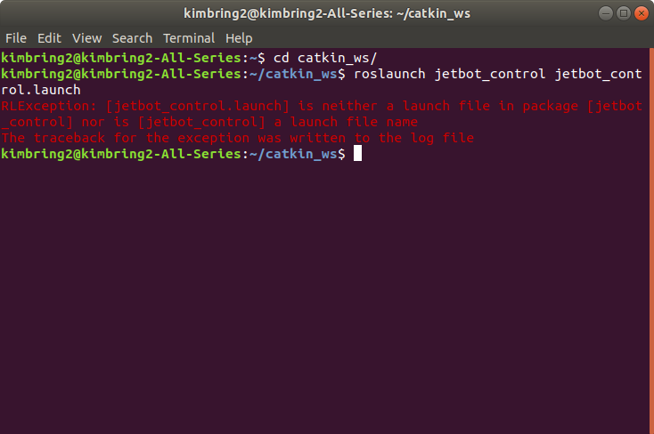

# Introduction

You can see a original Jetbot related code at https://github.com/dusty-nv/jetbot_ros/tree/master/gazebo. But, there is no URDF file of Jetbot which is needed for simulating a robot in Gazebo. Thus, I change SDF file of Jetbot to URDF. 

And all code are based on ROS URDF official tutorial http://gazebosim.org/tutorials?tut=ros_urdf where you can learn how to simulate a robot in Gazebo. I just chanage a simple 3-linkage, 2-joint arm robot of tutorial to Jetbot. 

I will upload a detailed post to https://kimbring2.github.io/2019/10/26/jetbot.html. Please rereference it if you need more information about uploaded code. 

# How to Build
```
cd ~/catkin_ws/src/
git clone https://github.com/kimbring2/jetbot_gazebo.git
cd ..
catkin_make
source devel/setup.bash
```
# Dependent package install
Put a 'https://github.com/kimbring2/jetbot_soccer/tree/master/spawn_robot_tools' folder to your 'catkin_ws/src' folder.

# How to view in Rviz
```
roslaunch jetbot_description jetbot_rviz.launch
```

# How to view in Gazebo
```
roslaunch jetbot_gazebo jetbot_world.launch
```

# How to start the controllers using roslaunch
```
roslaunch jetbot_gazebo jetbot_world.launch
roslaunch jetbot_control jetbot_control.launch
```

# Soccer model path setting
You should change a some code of sdf file at jetbot_gazebo/models/RoboCup15_MSL_Field, jetbot_gazebo/models/RoboCup15_MSL_Goal, jetbot_gazebo/models/football.

It is just example line of uri. Please change all uri path for your PC environment.
```
<uri>file:///home/[your ubuntu account]/catkin_ws/src/jetbot_soccer/jetbot_gazebo/materials/scripts/gazebo.material</uri>
```

# Troubleshooting 


If you get a RLException error message, type 'source devel/setup.bash' and try again.

# How to manually send example commands
The range of commands that can be given to the wheel is -360 to 360.

## Left Wheel 
```rostopic pub -1 /jetbot/joint1_velocity_controller/command std_msgs/Float64 "data: 150"```

## Right Wheel 
```rostopic pub -1 /jetbot/joint2_velocity_controller/command std_msgs/Float64 "data: 150"```

# Sending a commands in Python
Move to jetbot/jetbot_control/src/ and type ```python main.py```. It will send a velocity command to each wheel.
