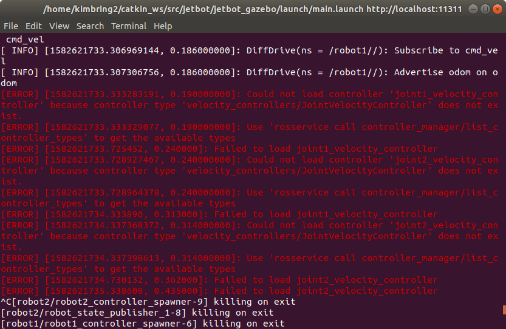
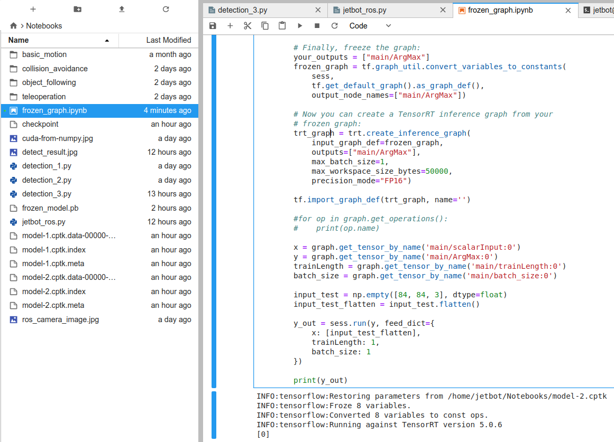

# 1. Introduction
The purpose of this project is making a soccer robot. For this purpose, various methods and tools are intoduced such as Robot Operation System (ROS) for robot control, Deep Reinforcement Learning for control algorithm. 

Due to the characteristic of Deep Learning, a large amount of training data is required. Thus, virtual simulation tool of ROS(Gazebo) is additionally used. The project uses the basic Deep Reinforcement Learning training and evaluation process. 

In order to use the robot algorithm trained in the virtual simulation in the real world, technique for reducing gap between simulation and real world such as domain randomization will be used.

In addition to opening software, information about hardware of robot will be shared for making other reseachres, makers can use this project for their own purpose.

# 2. Software Dependency
## 1) ROS, Gazebo
- ROS Melodic, Gazebo 9
- ROS openai_ros package
- Gazebo only provides Python 2.7(From ROS Noetic at Ubuntu 20.04, Python3 can be used)

## 2) Python 
- Tensorflow 2.1.0
- cvlib==0.1.8
- requests 
- progressbar
- keras
- opencv-python

# 3. Reference
- Jetbot SDF file, ROS: [Jetbot SDF file, ROS](https://github.com/dusty-nv/jetbot_ros)
- Gazebo parameter setting: [Gazebo parameter](https://github.com/CentroEPiaggio/irobotcreate2ros)
- URDF file usage in Gazebo: [URDF file usage in Gazebo](http://gazebosim.org/tutorials/?tut=ros_urdf)
- Object detecion using cvlib: [Object detecion using cvlib](https://towardsdatascience.com/object-detection-with-less-than-10-lines-of-code-using-python-2d28eebc5b11)
- Soccer field, ball model: [Soccer field, ball model](https://github.com/RoboCup-MSL/MSL-Simulator)
- Reinforcement Learnig model: [Reinforcement Learnig model](https://medium.com/emergent-future/simple-reinforcement-learning-with-tensorflow-part-6-partial-observability-and-deep-recurrent-q-68463e9aeefc)
- Inference saved model: [Tensorrt](http://litaotju.github.io/2019/01/24/Tensorflow-Tutorial-6,-Using-TensorRT-to-speedup-inference/)
- Onshape 3D model to URDF: [onshape-to-robot](https://github.com/rhoban/onshape-to-robot/)
- GPIO control for solenoid electromagnet : https://www.jetsonhacks.com/2019/06/07/jetson-nano-gpio/ ,https://github.com/NVIDIA/jetson-gpio
- Ball kicking mechanism: https://www.youtube.com/watch?v=fVGrYoqn-EU
- How to read LaserScan data(ROS python): https://www.theconstructsim.com/read-laserscan-data/
- Convert Video to Images (Frames) & Images (Frames) to Video using OpenCV (Python) : https://medium.com/@iKhushPatel/convert-video-to-images-images-to-video-using-opencv-python-db27a128a481
- Python Multithreading with pynput.keyboard.listener: https://stackoverflow.com/a/59520236/6152392
- How to use a Gazebo as type of OpenAI Gym : http://wiki.ros.org/openai_ros

# 4. Etc
## 1) Relationship between simualtion and real part
The purpose of this project is to train Jetbot to play soccer based on simulation and then apply trained model to actual Jetbot. Therefore, I am currently updating the code and description of the current simulation robot and the actual robot to this repository together. However, you can run only simulation without any actual hardware.

## 2) How to build ROS project
At your terminal, run below command.

```
$ cd ~/catkin_ws/src/
$ git clone https://github.com/kimbring2/DeepSoccer.git
$ cd ..
$ catkin_make
$ source devel/setup.bash
```

## 3) Dependent ROS package install
Put a 'https://github.com/kimbring2/DeepSoccer/tree/master/spawn_robot_tools' folder to your 'catkin_ws/src' folder.

# 5. Troubleshooting 
## 1) RLException Error
If you get a 'RLException' error message, use 'source devel/setup.bash' command and try again.


## 2) Could not find the GUI, install the 'joint_state_publisher_gui' package Error
If you get that error when try to run 'roslaunch jetbot_description jetbot_rviz.launch' command, try to install related package using below command at your terminal.

```
$ sudo apt install ros-melodic-joint-state-publisher-gui
```


## 3) Could not load controller Error
If you get a 'Could not load controller' error message, try to install related package using below command at your terminal.

```
$ sudo apt-get install ros-melodic-ros-control ros-melodic-ros-controllers
```




## 4) RViz 'No transform from' error

If you get error message includes 'No transform from', try to install unicode ubuntu package and reboot.

```
$ sudo apt-get install unicode 
```

# 6. Jetbot original version test
## 1) RViz test
```
$ roslaunch jetbot_description jetbot_rviz.launch
```

## 2) Gazebo test
```
roslaunch jetbot_gazebo main.launch
```

## 3) Soccer object 3D model path setting 
You should change a 3D model file path of jetbot/jetbot_gazebo/world/jetbot.world and sdf file at jetbot_gazebo/models/RoboCup15_MSL_Field, jetbot_gazebo/models/RoboCup15_MSL_Goal, jetbot_gazebo/models/football.

Below is example line of uri. Please change all uri path for your PC environment.
```
<uri>file:///home/[your ubuntu account]/catkin_ws/src/jetbot_soccer/jetbot_gazebo/materials/scripts/gazebo.material</uri>
```

## 4) How to manually send a wheel velocity commands
The range of velocity that can be given to the wheel is 0 to 100.

- Left Wheel(For robot1, robot2)
```rostopic pub -1 /robot1/joint1_velocity_controller/command std_msgs/Float64 "data: 30"```
```rostopic pub -1 /robot2/joint1_velocity_controller/command std_msgs/Float64 "data: 30"```

- Right Wheel(For robot1, robot2)
```rostopic pub -1 /robot1/joint2_velocity_controller/command std_msgs/Float64 "data: 30"```
```rostopic pub -1 /robot2/joint2_velocity_controller/command std_msgs/Float64 "data: 30"```

## 5) Python code for Gazebo simulator
Move to 'jetbot/jetbot_control/src/' folder and type ```python main.py```. 
It will send a velocity command to each wheel and show a camera sensor image. Furthermore, Tensorflow code for Reinforcement Learning is implemented. Jetbot is able to only learn how to track a soccer ball at now. However, I train more advanced behavior after finishing first task.

If you run a code, it will store a Tensorflow weight file at drqn folder of your workspace. 

## 6) Python code for real robot
First, set up ROS in actual Jetbot hardware based on manual of https://github.com/dusty-nv/jetbot_ros.

Then run roscore on Jetbot terminal and publish the camera frame using jetbot_camera node.
```
$ roscore 
$ rosrun jetbot_ros jetbot_camera 
```

You can control a wheel motor using below Python script. 
```
$ rosrun jetbot_ros jetbot_soccer_motors.py 
$ rostopic pub -1 /jetbot_soccer_motors/cmd_str std_msgs/String --once "30"
```

You can control a roller and solenoid motor using two Python script. 
```
$ rosrun jetbot_ros jetbot_soccer_roller.py 
$ rostopic pub -1 /jetbot_soccer_roller/cmd_str std_msgs/String --once "in"
$ rostopic pub -1 /jetbot_soccer_roller/cmd_str std_msgs/String --once "out"
```

```
$ rosrun jetbot_ros jetbot_soccer_solenoid.py 
$ rostopic pub -1 /jetbot_soccer_solenoid/cmd_str std_msgs/String --once "in"
$ rostopic pub -1 /jetbot_soccer_solenoid/cmd_str std_msgs/String --once "out"
```

You can also give a control command using Python code. Run 'jetbot_ros.py' file.
```$ python jetbot_ros.py ```

That file receive a image frame from camera and send a velecity command to each wheel. In this code, detecting soccer ball is performed using jetson.utils, jetson.inference.


## 7) Tensorflow model freezing for TensorRT inference
Tensorflow model trained using Gazebo simulation can be used without installing Tensorflow on Jetson Nano. However, model needs to be freezed. Please check a process for it at 'RL_model_froze.ipynb' file. You need to change a 'model_dir = "/home/kimbring2/catkin_ws/src/jetbot/jetbot_control/src/drqn"' line for your workplace setting.



You need to see a inference output at bottom of cell and modify 'model-1.cptk.meta' for your checkpoint name.

# 6. Jetbot soccer version
I remodel hardware of Jetbot because it is not suitable for soccer. As you know easily, soccer robot needd a kicking and holding part. The Jetbot soccer version can hold a soccer ball and kick it. The wheel part is changed to omniwheel type for moving more freely. Battery, DC motor, WiFi antenna of previous Jetbot are reused for easy developing.


I use Onshape cloud 3D modeling program to create a model. You can check and download my model from below link.

[Modified Jetbot 3D model Onshape link](https://cad.onshape.com/documents/242e5d0f2f1cbff393c8e507/w/37c9eecd4ded31866f99420c/e/9a6f236fb48a5317e2b639700)

[](https://youtu.be/zNTldaCe1ZQ "Jetbot Soccer Play - Click to Watch!")
<strong>Click to Watch!</strong>

After making 3D modeling, I convert it to URDF format for Gazebo simulation. I find and use a very convenient tool for that(https://github.com/rhoban/onshape-to-robot/)  

## 1) Dynamixel SDK test
The best way to use Dynamixel on Jetson Nano is using the SDK provided by ROBOTIS.

- Check your connection between motor and control board(I use a Dynamixel Wizard for checking a operation of motor).
- First, download a SDK from 'https://github.com/ROBOTIS-GIT/DynamixelSDK.git' to your Jetson Nano.
- Move to 'DynamixelSDK/python/tests/protocol1_0' and run 'ping.py'.


- Open 'read_write.py' and change a parameter for MX-12W(You can also change the parameter using Dynamixel Wizard).


- Run 'read_write.py' and you should see a success message like a below.


[](https://youtu.be/ZSii66zur4s "Jetbot Soccer Play - Click to Watch!")
<strong>Click to Watch!</strong>

## 2) RViz test
You can see a RViz 3D model of Jetbot soccer using below command.
```
roslaunch jetbot_description jetbot_soccer_rviz.launch
```

After launching a RViz, you can control of each wheel and roller using dialog box.

## 3) Gazebo test
After checking operation of each part at RViz, try to control it in Gazebo simulation.

```
roslaunch jetbot_gazebo main_soccer.launch
```

You can control of each wheel, roller, solenoid motor using 'rostopic pub' command.
First, adjust the speed of the wheels to approach to the ball.

- Command for wheel motor
```
rostopic pub -1 /robot1/wheel1_velocity_controller/command std_msgs/Float64 "data: 30"
rostopic pub -1 /robot1/wheel2_velocity_controller/command std_msgs/Float64 "data: 30"
rostopic pub -1 /robot1/wheel3_velocity_controller/command std_msgs/Float64 "data: 30"
rostopic pub -1 /robot1/wheel4_velocity_controller/command std_msgs/Float64 "data: 30"
```

Next, rotate a roller motor to pull the ball.

- Command for roller motor
```
rostopic pub -1 /robot1/roller_velocity_controller/command std_msgs/Float64 "data: 30"
```

Finally kick the ball via speed control of solenoid motor.

- Command for solenoid motor
```
rostopic pub -1 /robot1/stick_velocity_controller/command std_msgs/Float64 "data: 30"
```

If you run a 'main_soccer.py file in jetbot/jetbot_control file, you can give a command by typing a character.
```
s : stop
f : forward
l : left
r : right
h : hold ball
k : kick ball
```

Please check video for checking how to give a command(https://www.youtube.com/watch?v=rTVKIcgdVGo)

## 4) Command for lidar sensor
Soccer robot need to check a obstacle of front side. Using only camera sensor is not enough for that. Thus, I decide adding lidar sensor. Information of lidar sensor can be checked by using ROS topic named '/jetbot/laser/scan'

```
rostopic echo /jetbot/laser/scan -n1
```

Among that information, range from robot to front object can be got by using Python
```
def lidar_callback(msg):
    global lidar_range

    lidar_range = msg.ranges[360]
```

Gazebo simulator visualize the range of the lidar sensor. You can see the range value of lidar sensor is changed depending on the distance between the robot and front obstacle.

[](https://youtu.be/ZSii66zur4s "Jetbot Soccer Play - Click to Watch!")
<strong>Click to Watch!</strong>

## 5) Teleoperation test
Like the original version of Jetbot, Jetbot soccer version can be controlled by gamepad. You can check a code for that teleoperation_soccer.ipynb file. Upload it to Jetson Nano and run it.

[](https://www.youtube.com/watch?v=2b6BUH5tF1g "Jetbot Soccer Play - Click to Watch!")
<strong>Click to Watch!</strong>

You can use the gamepad for performing the basic actions for soccer. Multi players will be able to play robot soccer together if power of robot is a bit more reinforced. It is little weak for playing real soccer.

# 7. Use DeepSoccer as OpenAI Gym format 
Most Deep Reinforcement Learning researchers are accustomed to Gym environment of OpenAI. There is package called openai_ros that allows user use a custom robot environment in the form of Gym. 

DeepSoccer also provides a package for use a it as Gym format. First, download a my_deepsoccer_training pacakge from this repo. After that, copy it to the src folder under ROS workspace like a Jetbot package and build it.

The my_deepsoccer_training package is based on the my_turtlebot2_training package from the http://wiki.ros.org/openai_ros tutorial. I recommend that you first run a  tutorial package successfully.

After installing the my_deepsoccer_training package, you can use DeepSoccer with the following Gym shape. The basic actions and observations are the same as described in the Jetbot soccer section. Action is an integer from 0 to 6, indicating STOP, FORWARD, LEFT, RIGHT, BACKWARD, HOLD, and KICK, respectively. Observations are image frame from camera, robot coordinates, and lidar sensor value.

```
roslaunch my_deepsoccer_training start_training.launch
```

```
#!/usr/bin/env python
import gym
import numpy
import time
import cv2

# ROS packages required
import rospy
import rospkg
from openai_ros.openai_ros_common import StartOpenAI_ROS_Environment

rospy.init_node('example_deepsoccer_soccer_qlearn', anonymous=True, log_level=rospy.WARN)

task_and_robot_environment_name = rospy.get_param('/deepsoccer/task_and_robot_environment_name')
env = StartOpenAI_ROS_Environment(task_and_robot_environment_name)

for i_episode in range(20):
    observation = env.reset()

    for t in range(100):
        #env.render()
        #print("observation[0].shape: " + str(observation[0].shape))

        obs_image = observation[0]
        cv2.imshow("obs_image", obs_image)
        cv2.waitKey(3)

        print("observation[1]: " + str(observation[1]))
        print("observation[2]: " + str(observation[2]))
        print("observation[3]: " + str(observation[3]))
        action = env.action_space.sample()
        observation, reward, done, info = env.step(action)
        if done:
            print("Episode finished after {} timesteps".format(t+1))
            break

env.close()
```


# 8. Citation
If you use DeepSoccer to conduct research, we ask that you cite the following paper as a reference:

```
@misc{kim2020deepsoccer,
  author = {Dohyeong, Kim},
  title = {DeepSoccer},
  year = {2020},
  publisher = {GitHub},
  journal = {GitHub repository},
  howpublished = {\url{https://github.com/kimbring2/DeepSoccer/}},
  commit = {5689b3ab8934bc2f60360e3b180978b637fb2741}
}
```

# 9. Acknowledgement
 <strong>I get a prize from NVIDIA for this project</strong>

# 10. License
Apache License 2.0
