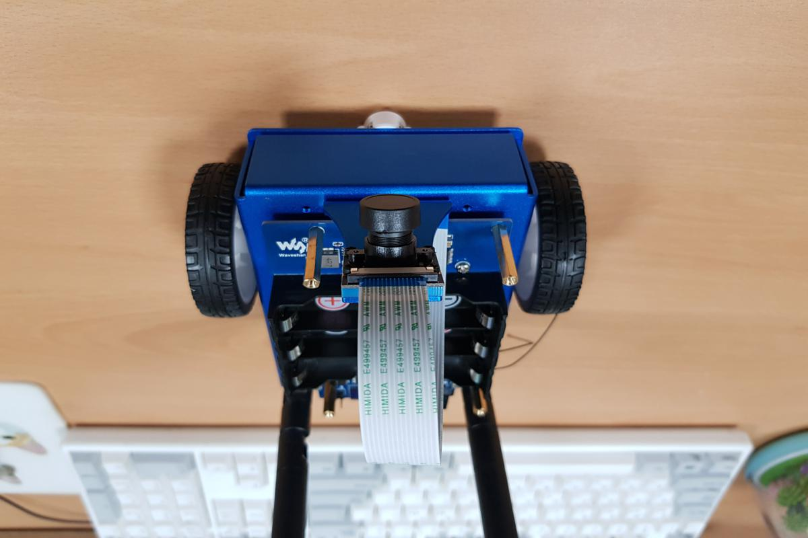
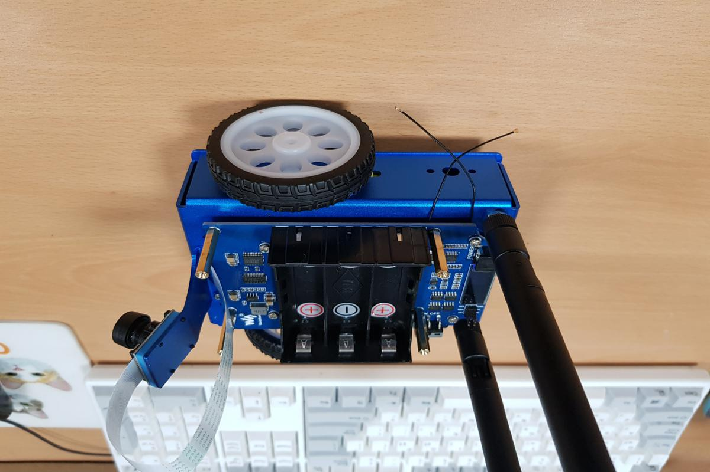

# Jetbot 
Recently, the Jetson Nano board released by Nvidia is announced, and robots using this and the robot operating system is putting on the market. One of them is a kind of line tracer robot that uses a camera. You can purchase one at Amazon (https://www.amazon.com/gp/product/B07WMZ3KLY/ref=ppx_yo_dt_b_asin_title_o03_s00?ie=UTF8&psc=1).

 

Also, ROS code for Jetbot is also released together, so it can be easily installed and tested.

# Soccer game using Jetbot
First of all, the reason I bought Jetbot is to try to implement robot soccer using this and Deep Learning. 
