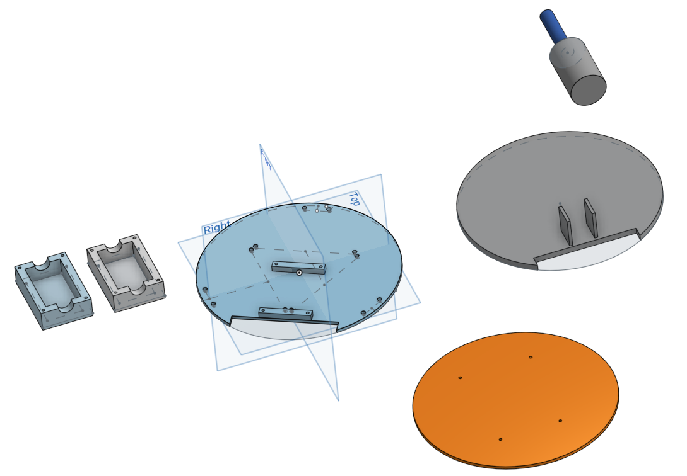
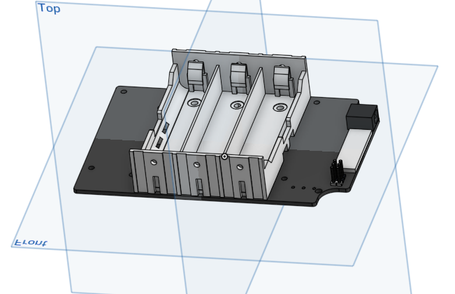
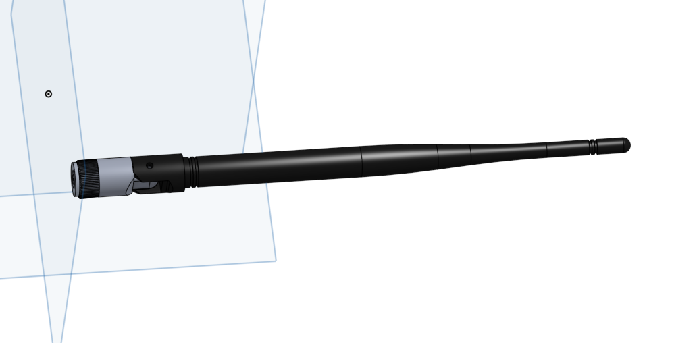
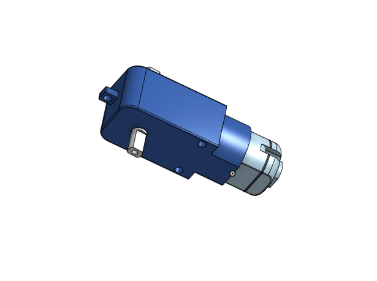
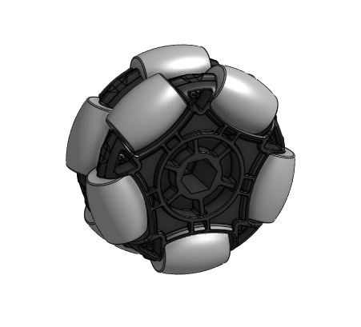

# Introduction
I started this is a project for making NVIDIA Jetbot playing soccer. I mainly use a Gazebo of ROS for traning Jetbot to play soccer. Traning Deep Learning algorithm is Reinforcmenet Learning. Thus, I need a virtual environment. After training, the trained model is moved to the actual Jetbot. I need to check that kind of approach will work well.

 <strong>I get a prize from NVIDIA for this project!</strong>

You can see a original Jetbot related code at https://github.com/dusty-nv/jetbot_ros/tree/master/gazebo. But, there is no URDF file of Jetbot which is needed for simulating a robot in Gazebo. Thus, I change SDF file of Jetbot to URDF. 

And all code are based on ROS URDF official tutorial http://gazebosim.org/tutorials?tut=ros_urdf where you can learn how to simulate a robot in Gazebo. I just chanage a simple 3-linkage, 2-joint arm robot of tutorial to Jetbot. 

I will upload a detailed post to https://kimbring2.github.io/2019/10/26/jetbot.html. Please see it if you need more information about code. 

# Issue list
1. ~There is a problem that robot does not move smoothly at high speed. It seems that the physical settings of the chassis and wheel are not set correctly. I am checking a parameter of other robot for solving that issue.~(solved)

# Python package
I use a tensorflow-gpu==1.13.1 for neural network part. And opencv-python, cvlib is neeed for soccer ball detection. 

# Reference
1. Jetbot SDF file, ROS : [Jetbot SDF file, ROS](https://github.com/dusty-nv/jetbot_ros)
2. Gazebo parameter : [Gazebo parameter](https://github.com/CentroEPiaggio/irobotcreate2ros)
3. URDF file usage in Gazebo : [URDF file usage in Gazebo](http://gazebosim.org/tutorials/?tut=ros_urdf)
4. Object detecion using cvlib: [Object detecion using cvlib](https://towardsdatascience.com/object-detection-with-less-than-10-lines-of-code-using-python-2d28eebc5b11)
5. Soccer field, ball model: [Soccer field, ball model](https://github.com/RoboCup-MSL/MSL-Simulator)
6. Reinforcement Learnig model : [Reinforcement Learnig model](https://medium.com/emergent-future/simple-reinforcement-learning-with-tensorflow-part-6-partial-observability-and-deep-recurrent-q-68463e9aeefc)
7. Inference saved model : [Tensorrt](http://litaotju.github.io/2019/01/24/Tensorflow-Tutorial-6,-Using-TensorRT-to-speedup-inference/)

# How to Build
```
cd ~/catkin_ws/src/
git clone https://github.com/kimbring2/jetbot_gazebo.git
cd ..
catkin_make
source devel/setup.bash
```
# Dependent package install
Put a 'https://github.com/kimbring2/jetbot_soccer/tree/master/spawn_robot_tools' folder to your 'catkin_ws/src' folder.

# How to view in Rviz
```
roslaunch jetbot_description jetbot_rviz.launch
```

# How to start Jetbot model and controllers using roslaunch
```
roslaunch jetbot_gazebo main.launch
```

# Soccer model path setting
You should change a some code of sdf file at jetbot_gazebo/models/RoboCup15_MSL_Field, jetbot_gazebo/models/RoboCup15_MSL_Goal, jetbot_gazebo/models/football.

It is just example line of uri. Please change all uri path for your PC environment.
```
<uri>file:///home/[your ubuntu account]/catkin_ws/src/jetbot_soccer/jetbot_gazebo/materials/scripts/gazebo.material</uri>
```

# Troubleshooting 


If you get a RLException error message, type 'source devel/setup.bash' and try again.

# How to manually send a wheel velocity commands
The range of velocity that can be given to the wheel is 0 to 100.

## Left Wheel 
For robot1
```rostopic pub -1 /robot1/joint1_velocity_controller/command std_msgs/Float64 "data: 30"```

For robot2
```rostopic pub -1 /robot2/joint1_velocity_controller/command std_msgs/Float64 "data: 30"```

## Right Wheel
For robot1
```rostopic pub -1 /robot1/joint2_velocity_controller/command std_msgs/Float64 "data: 30"```

For robot2
```rostopic pub -1 /robot2/joint2_velocity_controller/command std_msgs/Float64 "data: 30"```

# Python code for Gazebo Simulator
Move to 'jetbot/jetbot_control/src/' folder and type ```python main.py```. 
It will send a velocity command to each wheel and show a camera sensor image. Furthermore, Tensorflow code for Reinforcement Learning is implemented. Jetbot is able to only learn how to track a soccer ball at now. However, I train more advanced behavior after finishing first task.

If you run a code, it will store a Tensorflow weight file at drqn folder of your workspace. 

# Python code for real Jetbot
```$ roscore ```

```$ rosrun jetbot_ros jetbot_camera ```

```$ python jetbot_ros.py ```

First, set up ROS in actual Jetbot hardware based on manual of https://github.com/dusty-nv/jetbot_ros. Then run roscore on Jetbot terminal and publish the camera frame using jetbot_camera node. After that, when the uploaded jetbot_ros.py file is executed, it is possible to receive the camera frame as an input and output the speed of the left and right motors as an input in the same manner as one method in Gazebo. Also in this code, the part that detected the soccer ball using cvlib can be done with Jetson board using jetson.utils, jetson.inference.

# Tensorflow model freezing for TensorRT inference
Tensorflow model trained using Gazebo simulation can be used without installing Tensorflow on Jetson Nano. However, the saved model needs to be freezing by using first part of 'RL_model_froze.ipynb'. You need to change a 'model_dir = "/home/kimbring2/catkin_ws/src/jetbot/jetbot_control/src/drqn"' line for your workplace setting.


You should check a inference output at bottom of cell and modify 'model-1.cptk.meta' for your checkpoint name.

# Modify Jetbot for soccer
I am currently remodeling Jetbot's hardware because it is not suitable for soccer. The new Jetbot will secure a soccer ball and kick it. The wheels will also be changed to omniwheel type for moving more freely. Batterie and WiFi antennas of previous Jetbot seem to be reused for saving money.


 
 

I am currently using the Onshape cloud service to create a model, so if you go to that link you will be able to see the work status.

[Jetbot for soccer 3d model](https://cad.onshape.com/documents/242e5d0f2f1cbff393c8e507/w/37c9eecd4ded31866f99420c/e/9a6f236fb48a5317e2b63970)
