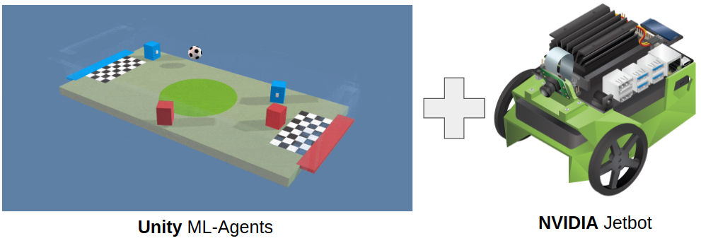
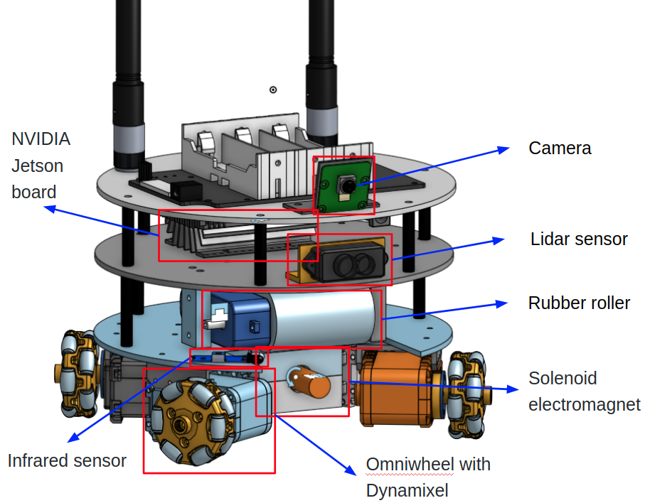
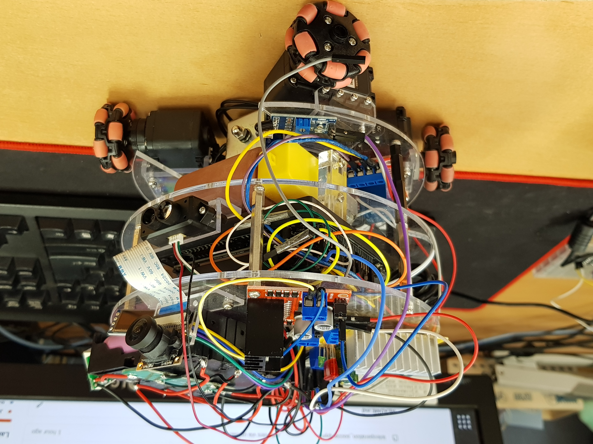
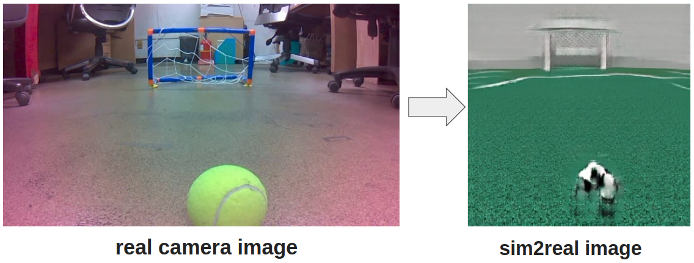
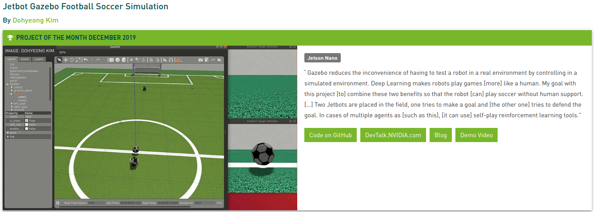
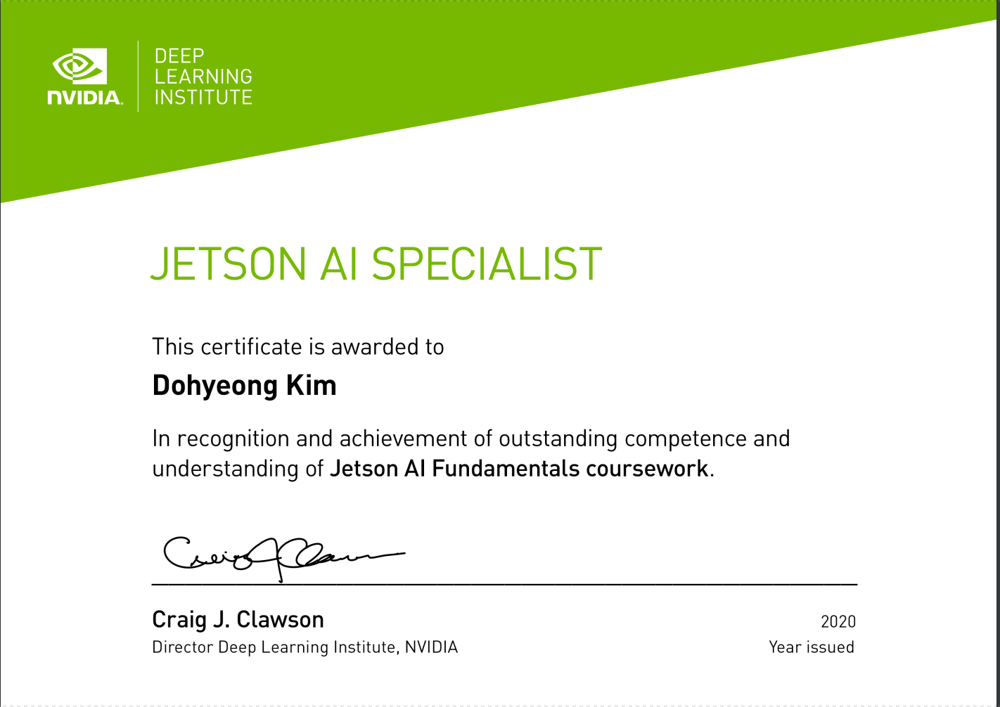

# 1. Introduction
The purpose of this project is to make a soccer robot. For this purpose, various methods and tools are used together such as Robot Operation System (ROS) for robot control, and Deep Reinforcement Learning for controlling algorithm. 

Due to the characteristic of Deep Learning, a large amount of training data is required. Thus, virtual simulation tool of ROS called Gazebo is additionally used. The project uses the one of famous Deep Reinforcement Learning algorithm which uses a human expert data for improving performance.

In order to use the robot algorithm trained in the virtual simulation in the real world, I use a CycleGAN for generating view of simulation world from view of real world. 

Finally, hardware information of robot also will be shared as 3D CAD format to allow other researchers, makers can use this project for their own purpose.

More detailed instruction can be found at my [blog post of DeepSoccer](https://kimbring2.github.io/2020/10/08/deepsoccer.html)

# 2. Prerequisite
This project started from originally [Jetbot](https://www.amazon.com/Waveshare-JetBot-AI-Kit-Accessories/dp/B07V8JL4TF/?th=1). Therefore, the hardware and software are advanced form of Jetbot. It is highly recommended that you first try to run original Jetbot before trying DeepSoccer.



# 3. Robot design
I remodel hardware of Jetbot because it is not suitable for soccer. As you know easily, soccer robot needd a kicking and holding part. The Jetbot soccer version can hold a soccer ball and kick it. The wheel part is changed to omniwheel type for moving more freely.

 

You can see detailed information about hardware design at https://kimbring2.github.io/2020/10/08/deepsoccer.html#design_deepsoccer.



# 5. Simulation
## 1. Software Dependency
- ROS Melodic, Gazebo 9
- ROS openai_ros package
- Gazebo only provides Python 2.7(From ROS Noetic at Ubuntu 20.04, Python3 can be used)
- Tensorflow 2.1.0
- requests 
- pynput
- progressbar
- opencv-python

## 2. Network Architecture


## 3. Usage
### Set model file for soccer field
First, Copy [deepsoccer_gazebo](https://github.com/kimbring2/DeepSoccer/tree/master/deepsoccer_pc/deepsoccer_gazebo) folder to '/home/[Your User Name]/.gazebo/models' for soccer field rendering.

### Training network using Supervised Learning&Reinforcement Learning
After setting everything mentioned above, download the [human expert data](https://drive.google.com/drive/folders/1QmYI_FL5cym3LTvm8hlLfZ1Bo50bUyfc?usp=sharing) from Google Drive. I collected that data manually. 

After that, extract it to your workspace folder. You need to set a workspace_path in [yaml file](https://github.com/kimbring2/DeepSoccer/blob/master/my_deepsoccer_training/config/deepsoccer_params.yaml).

After preparing the human expert data and config file, run below command. It will start a [tutorial file](https://github.com/kimbring2/DeepSoccer/blob/master/my_deepsoccer_training/src/gym_tutorial.py) of DeepSoccer as format of OpenAI Gym environment. 

```
$ cd ~/catkin_ws/src/
$ git clone https://github.com/kimbring2/DeepSoccer.git
$ cd ..
$ catkin_make
$ source devel/setup.bash
$ roslaunch my_deepsoccer_training start_tutorial.launch
```

Trained model, Tensorboard log are saved under 'src/train/' folder seperately. Try to check the loss is decreased under 0.3 point. 


If you set the sl_training config to False, pretrained_model to file name of trained model, it will start the Reinforcmenet Learning phase using trained model.

[](https://youtube.com/watch?v=64ENY3P8U88 "DeepSoccer- Click to Watch!")
<strong>Click to Watch!</strong>

### Collection human expert data


You can also collect the human expert dataset using 'roslaunch my_deepsoccer_training start_dataset.launch' command. After Gazebo screen is poped up, you can control robot using 8 command.

The name of the replay file and the path to be saved can be set in the [config file](https://github.com/kimbring2/DeepSoccer/blob/master/my_deepsoccer_training/config/deepsoccer_params.yaml).

## 4. Troubleshooting 
### 1) RLException Error
If you get a 'RLException' error message, use 'source devel/setup.bash' command and try again.

### 2) Could not find the GUI, install the 'joint_state_publisher_gui' package Error
If you get that error when try to run 'roslaunch jetbot_description jetbot_rviz.launch' command, try to install related package using below command at your terminal.

```
$ sudo apt install ros-melodic-joint-state-publisher-gui
```

### 3) Could not load controller Error
If you get a 'Could not load controller' error message, try to install related package using below command at your terminal.

```
$ sudo apt-get install ros-melodic-ros-control ros-melodic-ros-controllers
```

### 4) RViz 'No transform from' error

If you get error message includes 'No transform from', try to install unicode ubuntu package and reboot.

```
$ sudo apt-get install unicode 
```

## 5. Docker 
You can also use a Docker image for this repo using below command. Afte that, you can connect to created container by VNC(http://127.0.0.1:6080/#/).

```
$ docker run -it --rm -p 6080:80 --name=env_1 kimbring2/deepsoccer:latest
```

Because of low speed of Gazebo simulation in Docker image, you need to see Gazebo of it by using host PC. However, you shoud place ROS package to ' /root/catkin_ws/src' for rendering robot model. After that, get IP address of Docker image and connect to it by using below command.

```
$ export GAZEBO_MASTER_IP=$(docker inspect --format '{{ .NetworkSettings.IPAddress }}' env_1)
$ export GAZEBO_MASTER_URI=$GAZEBO_MASTER_IP:11345
$ gzclient --verbose
```

After connecting to the docker image with VNC, move to the catkin_ws folder. Then, you can start the simulation by executing the following command.

# 6. Relationship between simualtion and real part
The purpose of this project is to train Jetbot to play soccer based on simulation and then apply trained model to actual Jetbot. Therefore, I am currently updating the code and description of the current simulation robot and the actual robot to this repository together.

Each ROS package for simulation and real robot is placed separately in two folder.

1. ROS package for simulation robot: https://github.com/kimbring2/DeepSoccer/tree/master/deepsoccer_pc
2. ROS package for real robot: https://github.com/kimbring2/DeepSoccer/tree/master/deepsoccer_jetson
3. Simulation to Real to connect 1, 2 method: https://github.com/kimbring2/DeepSoccer/blob/master/sim2real

You can run each part separately. However, two part should be connected by sim2real method.

# 7. Reference
- Jetbot SDF file, ROS: [Jetbot SDF file, ROS](https://github.com/dusty-nv/jetbot_ros)
- Gazebo parameter setting: [Gazebo parameter](https://github.com/CentroEPiaggio/irobotcreate2ros)
- URDF file usage in Gazebo: [URDF file usage in Gazebo](http://gazebosim.org/tutorials/?tut=ros_urdf)
- Object detecion using cvlib: [Object detecion using cvlib](https://towardsdatascience.com/object-detection-with-less-than-10-lines-of-code-using-python-2d28eebc5b11)
- Soccer field, ball model: [Soccer field, ball model](https://github.com/RoboCup-MSL/MSL-Simulator)
- Reinforcement Learnig model: [Reinforcement Learnig model](https://medium.com/emergent-future/simple-reinforcement-learning-with-tensorflow-part-6-partial-observability-and-deep-recurrent-q-68463e9aeefc)
- Inference saved model: [Tensorrt](http://litaotju.github.io/2019/01/24/Tensorflow-Tutorial-6,-Using-TensorRT-to-speedup-inference/)
- Onshape 3D model to URDF: [onshape-to-robot](https://github.com/rhoban/onshape-to-robot/)
- GPIO control for solenoid electromagnet : https://www.jetsonhacks.com/2019/06/07/jetson-nano-gpio/ ,https://github.com/NVIDIA/jetson-gpio
- Ball kicking mechanism: https://www.youtube.com/watch?v=fVGrYoqn-EU
- How to read LaserScan data(ROS python): https://www.theconstructsim.com/read-laserscan-data/
- Convert Video to Images (Frames) & Images (Frames) to Video using OpenCV (Python) : https://medium.com/@iKhushPatel/convert-video-to-images-images-to-video-using-opencv-python-db27a128a481
- Python Multithreading with pynput.keyboard.listener: https://stackoverflow.com/a/59520236/6152392
- How to use a Gazebo as type of OpenAI Gym: http://wiki.ros.org/openai_ros
- Solenoid joint spring plugin: https://github.com/aminsung/gazebo_joint_torsional_spring_plugin
- Custom control plugin for Gazebo: http://gazebosim.org/tutorials?tut=guided_i5&cat=
- Forgetful Expirience Replay for Reinforcement Learning from Demonstrations: https://github.com/cog-isa/forger
- Compiling ROS cv_bridge with Python3: https://cyaninfinite.com/ros-cv-bridge-with-python-3/
- Style Transfer for Sim2Real: https://github.com/cryu854/FastStyle
- CycleGAN for Sim2Real: https://www.tensorflow.org/tutorials/generative/cyclegan
- Image Segmentation for CycleGAN: https://www.kaggle.com/santhalnr/cityscapes-image-segmentation-pspnet
- Docker Gazebo: https://hub.docker.com/_/gazebo
- Docker image for ROS melodic: https://github.com/fbottarel/docker-ros-desktop-full

# 8. Citation
If you use DeepSoccer to conduct research, we ask that you cite the following paper as a reference:

```
@misc{kim2020deepsoccer,
  author = {Dohyeong, Kim},
  title = {DeepSoccer},
  year = {2020},
  publisher = {GitHub},
  journal = {GitHub repository},
  howpublished = {\url{https://github.com/kimbring2/DeepSoccer/}},
  commit = {9ccab28a7e2a9a14caa119a765f95e2c6d0b044e}
}
```

# 9. Acknowledgement
 <strong>I receive a prize from NVIDIA for this project</strong>

 <strong>I receive Jetson AI Specialist certification from NVIDIA by this project</strong>

# 10. License
Apache License 2.0
